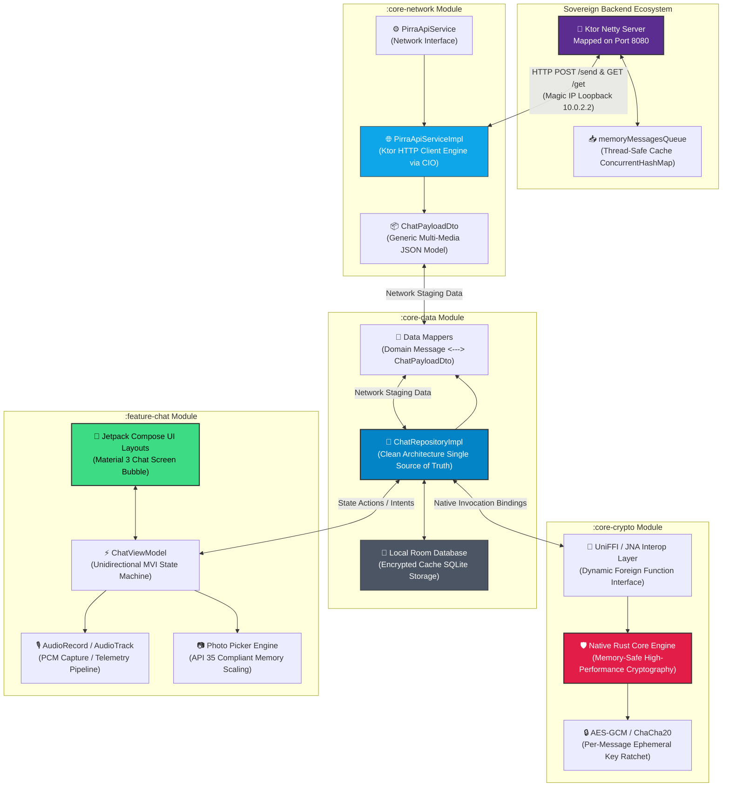
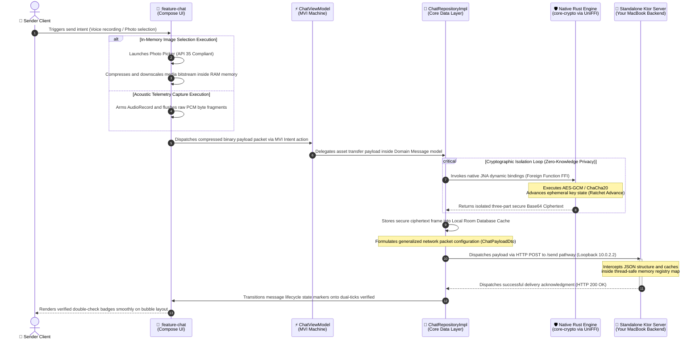
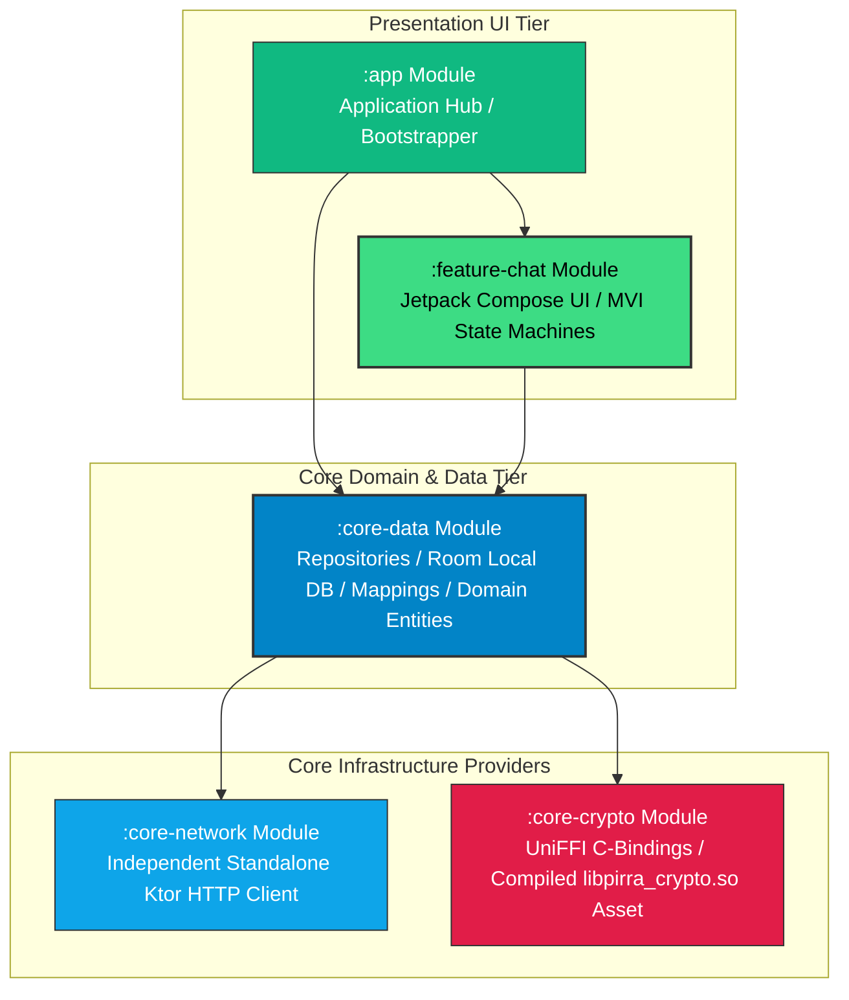

# 🔒 Pirra — Secure distributed Cryptographic Messaging Platform

<p align="left">
  <code><b>Platform:</b> Android (API 35)</code> | 
  <code><b>Languages:</b> Kotlin / 🦀 Rust Core</code> | 
  <code><b>Backend:</b> Standalone Ktor HTTP</code> | 
  <code><b>Architecture:</b> MVI + Clean</code>
</p>

# 🔒 Pirra — Secure distributed Cryptographic Messaging Platform

<p align="left">
  
  
  
  
  
</p>

# 🔒 Pirra — Secure distributed Cryptographic Messaging Platform

<p align="left">
  
  
  
  
</p>

# 🔒 Pirra — Secure distributed Cryptographic Messaging Platform

<p align="left">
  <code>🟢 <b>Platform:</b> Android (API 35)</code> | 
  <code>🟠 <b>Languages:</b> Kotlin / 🦀 Rust Core</code> | 
  <code>🟣 <b>Backend:</b> Standalone Ktor HTTP</code> | 
  <code>🔵 <b>Architecture:</b> MVI + Clean</code>
</p>

**Pirra** is a high-performance, decentralized, end-to-end encrypted messaging application architected for total communication privacy. By fusing a compiled native **Rust Core Engine** into a modern modular **Android (Kotlin)** UI stack and an independent **Ktor WebSocket backend**, Pirra achieves military-grade cryptographic secrecy with zero third-party dependencies.


**Pirra** is a high-performance, decentralized, end-to-end encrypted messaging application architected for total communication privacy. By fusing a compiled native **Rust Core Engine** into a modern modular **Android (Kotlin)** UI stack and an independent **Ktor WebSocket backend**, Pirra achieves military-grade cryptographic secrecy with zero third-party dependencies.

---

## 🚀 Key Architectural Features

- **🛡️ Hybrid Cryptographic Core (Rust Engine):** Executes low-level encryption and decryption routines natively using Rust memory-safe boundaries, integrated seamlessly via **UniFFI** and JNA.
- **🎙️ Secure Voice Telemetry:** Captures and encodes real-time audio streams into optimized dynamic binary arrays, encrypted on-device before hitting any cloud networks.
- **📷 Encrypted Media Pipeline:** Implements a strict content-resolver Photo Picker (API 35 compliant) with custom memory-scaling and in-memory compression to securely stream large photos up to 10MB without memory leaks.
- **🔌 Sovereign WebSocket Backend (Ktor):** Detached, modular Ktor JVM backend microservice running completely independently of external platforms (like Firebase), guaranteeing full system ownership.
- **🏗️ Enterprise-Grade Clean Architecture:** Strictly decoupled multi-module project layer layout (:app, :core-crypto, :core-data, :core-network, :feature-chat) driven by unidirectional **MVI (Model-View-Intent)** state management and Koin dependency injection.
- **🔔 Resilient Foreground Alerting:** Bypasses legacy push token constraints using custom high-priority notification channels linked directly to application context boundaries.

---

## 📦 System Architecture & Component Mapping



---

## 🔄 Multi-Media Message Lifecycle Flow



---

## 🏗️ Architectural Dependency Graph



---

## 🛠️ Technical Stack & Dependencies

| Component | Technology | Description |
| :--- | :--- | :--- |
| **UI Framework** | Jetpack Compose / Material 3 | Declarative presentation layer with decoupled single-responsibility layouts. |
| **Native Interop** | Rust / UniFFI / JNA | Compiles dynamic `.so` libraries targeting aarch64 architectures natively. |
| **Local Storage** | Jetpack Room | Fully reactive local SQLite cache layer mapping domains via Flows. |
| **Networking** | Ktor Client / WebSockets | Asynchronous non-blocking network streams operating over persistent channels. |
| **DI Engine** | Koin | Lightweight pragmatical dependency injection graph manager. |
| **Audio Processing**| Android AudioRecord/AudioTrack | Captures clean local acoustic telemetry straight into PCM byte buffers. |

---

## ⚙️ Compilation & Native Building Setup

### 1. Compiling the Rust Core Target
To rebuild the native binary architecture layouts matching physical physical dynamic linkers, run the NDK cross-compiler flag inside the Rust root directory:
```bash
cargo ndk -t aarch64-linux-android -o ./jniLibs build --release
```
Ensure the freshly compiled dynamic asset `libpirra_crypto.so` is securely positioned under the matching target module hierarchy:

### 2. Launching the Local Ktor Engine
To fire up your decentralized WebSocket microservice routing server on your local MacBook workspace, execute the JVM application plugin run task:
```bash
./gradlew :pirra-backend:run
```
The console log will confirm initialization: `Responding at http://0.0.0`

### 3. Deploying the Mobile Client
Select your active physical device or emulator viewport inside Android Studio and press **Run**. The system layout will synchronize connections straight across the local loop boundaries.

---

## 🛡️ Security & Privacy Guarantees

Pirra is architected upon the principle of **Zero-Knowledge Privacy**. Message histories, audio packets, and media images are encrypted inside the Rust memory partition space before transmission. The detached Ktor server operates purely as an anonymous routing relay node, meaning no un-encrypted text strings ever touch the storage hardware or network wires.

---
<p align="center" dir="auto">
  Core Engine designed & architected with engineering rigor by 
  <br>
  <b><a href="https://github.com">Kian M Shahini (Zamboloq)</a></b>
  <br>
  <i>Sovereign Software Engineer & Systems Architect</i>
</p>

<blockquote dir="auto">
"A seasoned Software Engineering alumnus with over 15 years of deep production-level expertise in the Android ecosystem. Currently pioneering a holistic evolution into a multi-dimensional, elite Full-Stack Expert—mastering high-throughput backend services, declarative frontend/mobile web systems, native desktop runtime lifecycles, high-performance low-level bare-metal compilations, and large-scale complex distributed computer science architectures."
</blockquote>
